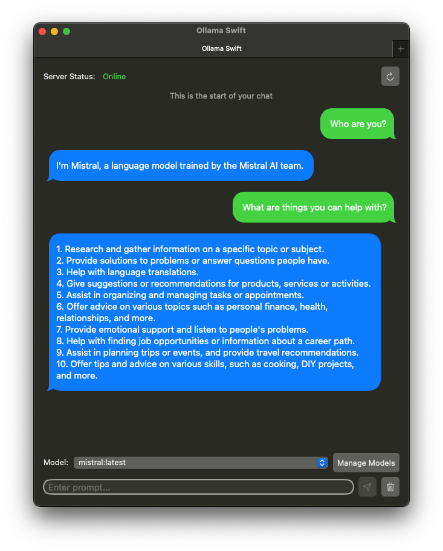
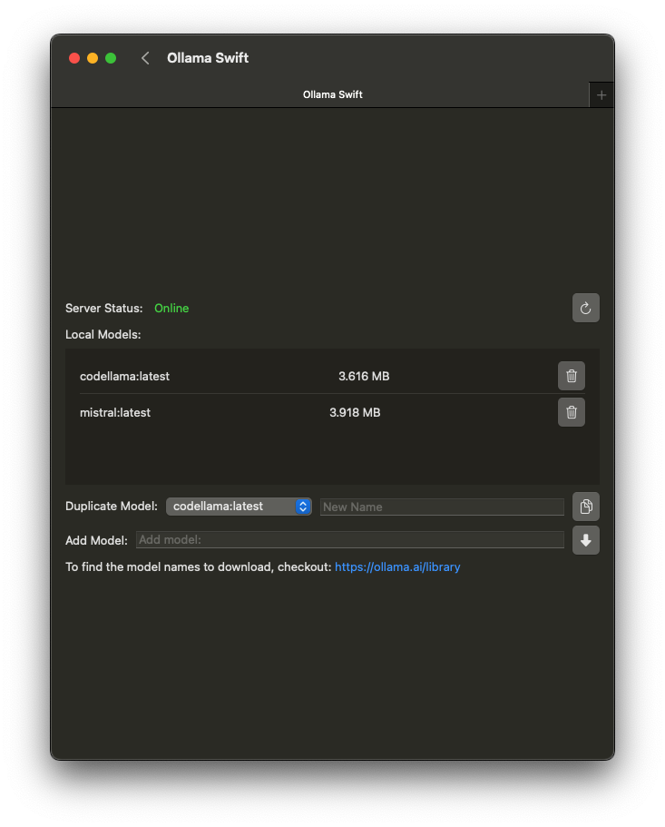

# Ollama-SwiftUI
A user-friendly interface for [Ollama AI](https://ollama.ai) created in Swift. This application is not directly affiliated with Ollama.ai

**This app requires Ollama to be installed and online to function.** Install Ollama: https://ollama.ai

## Features
1. Chatting with local Large Language Models.
2. Ability to change model mid conversation.
3. Restart Conversation at anytime.
4. New Tabs for different conversations.
5. Ability to download models using the GUI (Check https://ollama.ai/library for list of model names to download)
6. Ability to delete models
7. Ability to duplicate models
8. Light and Dark Mode
9. Localizable interface. Currently Localized in: English and Arabic

## Getting Started:
1. Install Ollama ( https://ollama.ai )
2. Open Ollama
3. Run Ollama Swift
4. Download your first model by going into Manage Models
    - Check possible models to download on: https://ollama.ai/models
    - Copy and paste the name and press on the download button
5. Select the model from the dropdown in the main page to start your conversation
6. Write your prompt and start the conversation!
