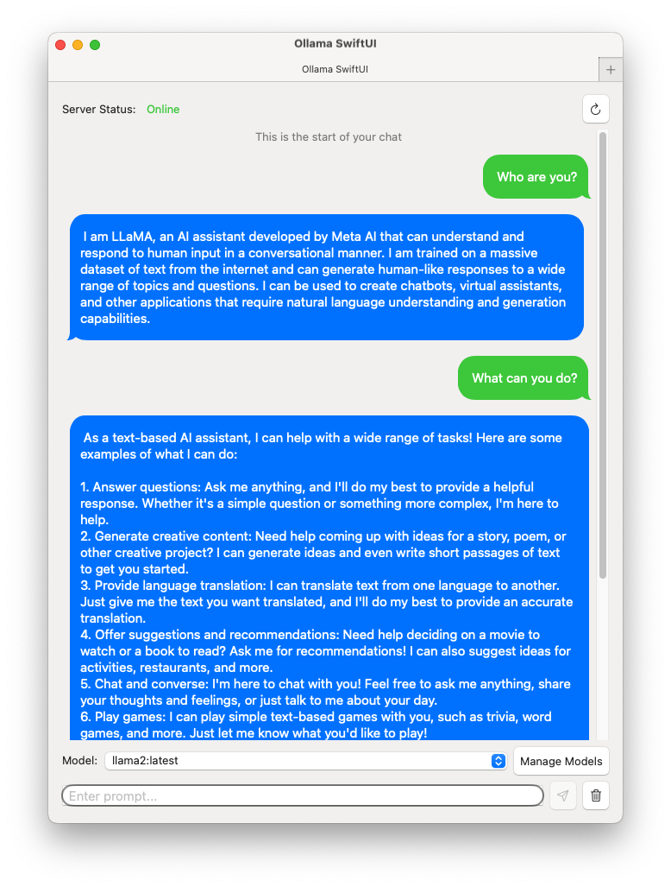
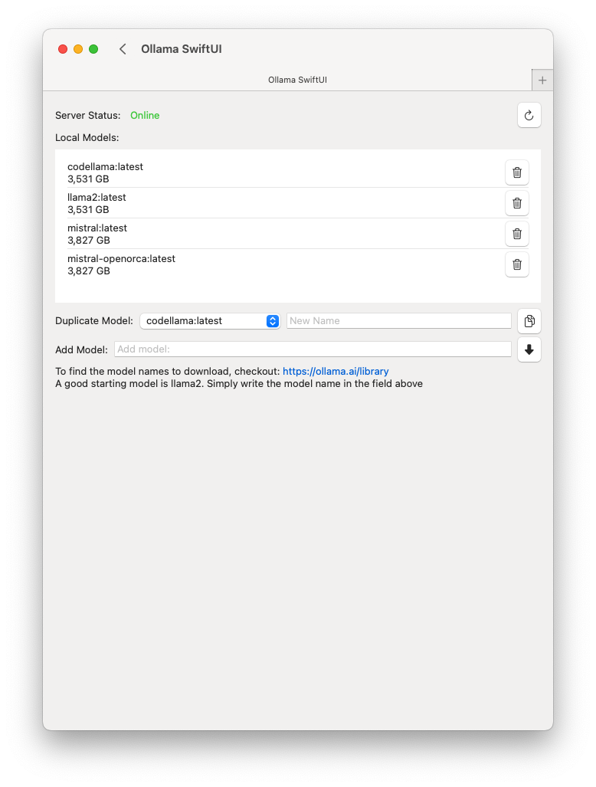
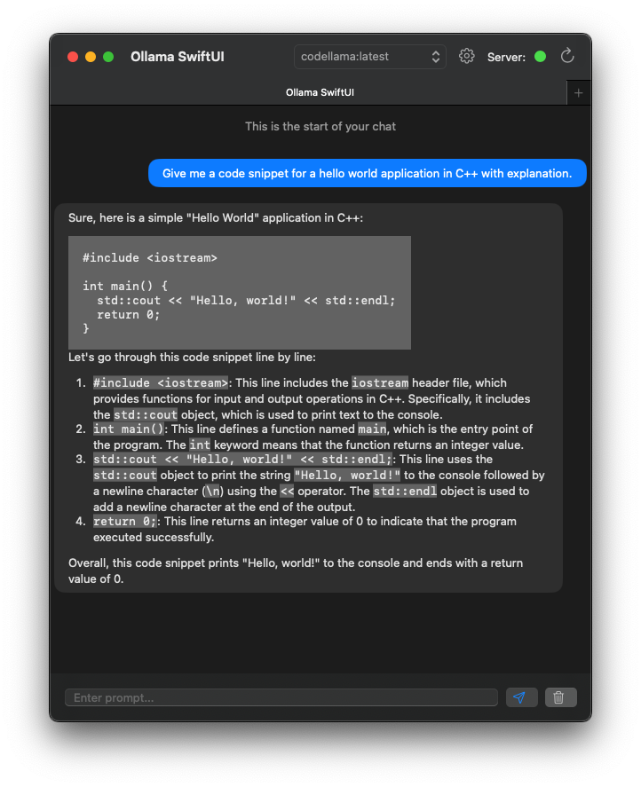
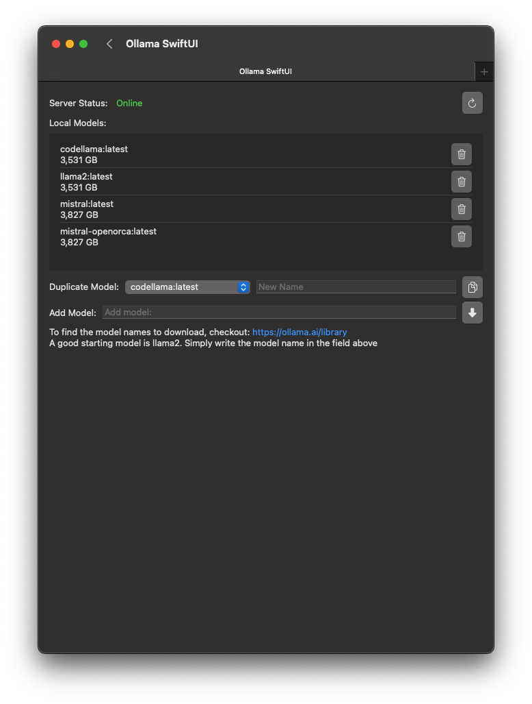

# Ollama-SwiftUI

    

A user-friendly interface for [Ollama AI](https://ollama.ai) created in Swift. This application is not directly affiliated with Ollama.ai

**This app requires Ollama to be installed and online to function.** Install Ollama: https://ollama.ai

## Table of Content
1. [Introduction](#introduction)
2. [Changelog](CHANGELOG.md)
3. [Features](#features)
4. [Getting Started](#getting-started)
5. [Frequently Asked Questions](#frequently-asked-questions)
6. [Dark Mode showcase](#dark-mode-also-available)
7. [Feedback and Contributions](#feedback-and-contributions)
8. [Contribution Hall of Fame](#contributors-hall-of-fame)

## Introduction
A user-friendly interface for [Ollama AI](https://ollama.ai) created in Swift. This application is not directly affiliated with Ollama.ai. It allows you to chat seamlessly with Large Language models downloaded to your mac. 

**This app requires Ollama to be installed and online to function.** Install Ollama: https://ollama.ai

## Features
1. Chatting with local Large Language Models.
2. Ability to change model mid conversation.
3. Restart Conversation at anytime.
4. New Tabs for different conversations.
5. Ability to download models using the GUI (Check https://ollama.ai/library for list of model names to download)
6. Ability to delete models
7. Ability to duplicate models
8. Light and Dark Mode
9. Localizable interface. Currently Localized in: English and Arabic

## Getting Started:
1. Install Ollama ( https://ollama.ai )
2. Open Ollama
3. Run Ollama Swift
4. Download your first model by going into Manage Models
    - Check possible models to download on: https://ollama.ai/models
    - Copy and paste the name and press on the download button
5. Select the model from the dropdown in the main page to start your conversation
6. Write your prompt and start the conversation!

## Frequently Asked Questions:
### 1. I am getting a Server is unreachable error
- You need to download and install https://Ollama.ai and it must be running in the background for this interface to work.

### 2. How to change the target IP and port?
- You can modify the IP address and port in the settings. Ollama SwiftUI > Preferences

### 3. I am getting "Cannot Be Opened Because the Developer Cannot be Verified" error when trying to open the app
- To fix this go to your macos `System Settings > Privacy and Security > Allow Applications downloaded from > App Store and Identified Developer` and you will find a button saying `Open Anyway`
- This is completely normal. Open source applications are often not submitted to Apple for code review. You can read more about it [here](https://support.apple.com/en-gb/guide/mac-help/mh40616/mac). This does not mean that the application is not safe. In fact, this is the beauty of open source. You can verify it yourself. 

### 4. I would like a new feature X 
- Feel free to create a suggestion by creating a new issue in the repo, or emailing me feedback@kghandour.com 
- This is a passion project so it will not be perfect and since I am doing it on my own time, I will try my best to get to it as soon as possible.

### 5. I found bug X
- Feel free to create a bug report by creating a new issue in the repo, or emailing me bugs@kghandour.com 
- This is a passion project so it will not be perfect and since I am doing it on my own time, I will try my best to get to it as soon as possible.

### 6. I would like to contribute to the project
- Please do so! It is amazing when contributing to open-source projects. Create a pull-request and I will try to review it as soon as possible. 

### 7. Are there any system requirements?
- This is a very simple light-weight user interface. As long as you can run https://ollama.ai locally, then this application should work as well.

## Dark Mode also available!

## Feedback and Contributions:
For bugs and feedback, please create a new issue or email bugs@kghandour.com 
Feel free to contribute by creating a Pull request and the best effort will be done to review and merge.

## Contributors Hall of Fame:
@HiRoS-neko
@Tooflex
